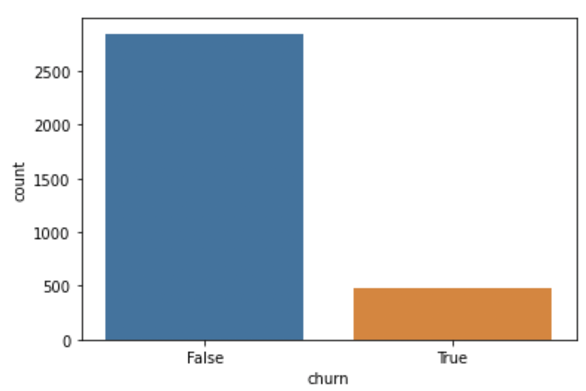

#### 05/01/2023
#### Joshua Edelstein

# Telecom Churn Analysis
## Overview

Most telecom companies suffer from churn(loss of customers to competition). Churn rate has strong impact on the life time value of the customer because it affects the length of service and the future revenue of the company. For example if a company has 25% churn rate then the average customer lifetime is 4 years; similarly a company with a churn rate of 50%, has an average customer lifetime of 2 years. It is estimated that 75 percent of the 17 to 20 million subscribers signing up with a new wireless carrier every year are coming from another wireless provider. Telecom companies spend hundreds of dollars to acquire a new customer and when that customer leaves, the company not only loses the future revenue from that customer but also the resources spent to acquire that customer.

Telecom companies have used two approaches to address churn - (a) Untargeted approach and (b) Targeted approach. The untargeted approach relies on creating brand loyalty in hopes of retaining customers. The targeted approach relies on identifying customers who are likely to churn, and then providing intervention to encourage them to stay.[[1]](#cite_note-1)

1. [^](#cite_ref-1) Data from CrowdAnalytix, https://www.crowdanalytix.com/contests/why-customer-churn

## Business Understanding

SyriaTel is a smaller end wireless provider, they don't have such the budget to invest in a large scale advertising campaign. However, they also can't afford to keep losing customers. Therefore they have turned to us to create a model for predicting which customers will churn. When a customers has been determined as likely to churn they will reach out to them in hopes of keeping the customer.

In this scenario we will break the data into 2 categories: 1) the columns used to predict churn(predictors) 2) the target column of whether the customers churned or not. If churn is "True" that means the customer churned, and "False" if the customer didn't churn. 

In general it is important to consider beforehand whether a false positive or false negative is worse. In each specific case one should tune their model based on what is more important. In our case a false positive means that we predicted the customer would churn when they didn't. The outcome of this is that we will send them some promotional deals, and perhaps give them a discount. This will in turn cause a slight loss of profit, as these clients were already happy paying full price. On the other hand, a false negative is when we predict that a customer won't churn when really they will. This means that we will lose a customer without ever sending them promotional deals to try to get them to stay. The loss from this mistake is far greater then the loss from a false positive. As such when we are creating models we will attempt to minimize false negatives(maximize recall) as much as possible.

Photo by <a href="https://unsplash.com/@giggiulena?utm_source=unsplash&utm_medium=referral&utm_content=creditCopyText">Mario Caruso</a> on <a href="https://unsplash.com/photos/0C9VmZUqcT8?utm_source=unsplash&utm_medium=referral&utm_content=creditCopyText">Unsplash</a>
  
## Data Understanding
This public dataset is provided by the CrowdAnalytix community as part of their churn prediction competition. The real name of the telecom company is anonymized, as well as the year of the data. However, it was used in competition in 2012, so seemingly from around then. 

Data source : https://www.crowdanalytix.com/contests/why-customer-churn

The data consists of 20 column. The last column in the dataset is `churn` which will be our target column. The other columns are predictors columns, these include columns giving details about calls, charges, period with the company, number of customer service calls, as well as other predictors.

We ran some basic EDA and here are some of the findings:

Here is the count of customers per state across the USA:

Additionally here is a bar graph of the amount of customers who churned:

This came out to a churn rate of 14%

## Data Preparation

The data didn't have any missing or duplicated values, as such this step was very brief. 

We dropped the phone number column as it has no affect on the churn percentage. 
It was interesting to note that all the area codes in this dataset were from California, eventhough the state column listed clients in many states. This was probably done to keep the phone numbers of the original clients secret.

