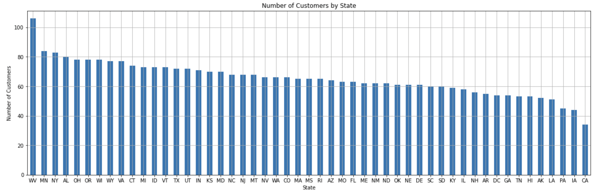
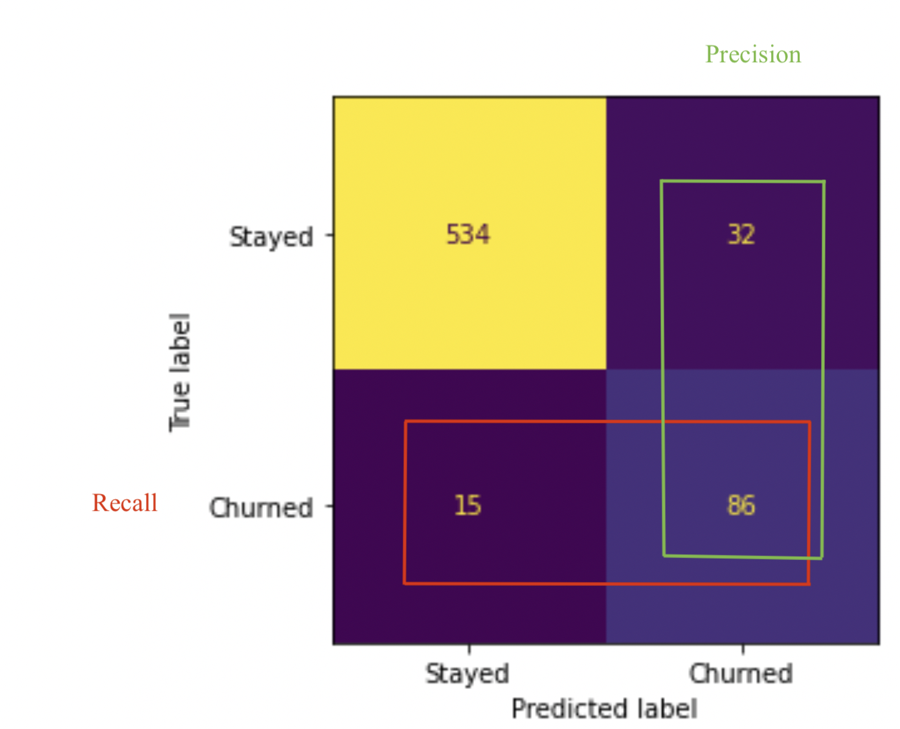

#### 05/01/2023
#### Joshua Edelstein

# Telecom Churn Analysis
## Overview

Most telecom companies suffer from churn(loss of customers to competition). Churn rate has the strong impact on the life time value of the customer because it affects the length of service and the future revenue of the company. For example if a company has 25% churn rate then the average customer lifetime is 4 years; similarly a company with a churn rate of 50%, has an average customer lifetime of 2 years. It is estimated that 75 percent of the 17 to 20 million subscribers signing up with a new wireless carrier every year are coming from another wireless provider. Telecom companies spend hundreds of dollars to acquire a new customer and when that customer leaves, the company not only loses the future revenue from that customer but also the resources spent to acquire that customer.

Telecom companies have used two approaches to address churn - (a) Untargeted approach and (b) Targeted approach. The untargeted approach relies on creating brand loyalty in hopes of retaining customers. The targeted approach relies on identifying customers who are likely to churn, and then providing intervention to encourage them to stay.[[1]](#cite_note-1)

1. [^](#cite_ref-1) Data from CrowdAnalytix, https://www.crowdanalytix.com/contests/why-customer-churn

## Business Understanding

SyriaTel is a smaller end wireless provider, they don't have the budget to invest in a large scale advertising campaign. However, they also can't afford to keep losing customers. Therefore they have turned to us to create a model for predicting which customers will churn.

In this scenario we will break the data into 2 categories: 1) the columns used to predict churn(predictors) 2) the target column of whether the customers churned or not. If churn is "True" that means the customer churned, and "False" if the customer didn't churn. 

In general it is important to consider beforehand whether a false positive or false negative is worse. In each specific case one should tune their model based on what is more important. In our case a false positive means that we predicted the customer would churn when they didn't. The outcome of this is that we will send them some promotional deals, and perhaps give them a discount. This will in turn cause a slight loss of profit, as these clients were already happy paying full price. On the other hand, a false negative is when we predict that a customer won't churn when really they will. This means that we will lose a customer without ever sending them promotional deals to try to get them to stay. The loss from this mistake is far greater then the loss from a false positive. As such when we are creating models we will attempt to minimize false negatives(maximize recall) as much as possible.

Photo by <a href="https://unsplash.com/@giggiulena?utm_source=unsplash&utm_medium=referral&utm_content=creditCopyText">Mario Caruso</a> on <a href="https://unsplash.com/photos/0C9VmZUqcT8?utm_source=unsplash&utm_medium=referral&utm_content=creditCopyText">Unsplash</a>
  
## Data Understanding
This public dataset is provided by the CrowdAnalytix community as part of their churn prediction competition. The real name of the telecom company is anonymized, as well as the year of the data. However, it was used in competition in 2012, so seemingly from around then. 

Data source : https://www.crowdanalytix.com/contests/why-customer-churn

The data consists of 20 columns. The last column in the dataset is `churn` which will be our target column. The other columns are predictors columns, these include columns giving details about calls, charges, period with the company, number of customer service calls, as well as other predictors.

We ran some basic EDA and here are some of the findings:

Here is the count of customers per state across the USA:

Additionally here is a bar graph of the amount of customers who churned:

This came out to a churn rate of 14%

## Data Preparation

The data didn't have any missing or duplicated values, as such this step was very brief. 

We dropped the phone number column as it has no affect on the churn percentage. 
It was interesting to note that all the area codes in this dataset were from California, eventhough the state column listed clients in many states. This was probably done to keep the confidentiality of the original clients.

## Data Analysis/ Modeling 

We split our data into a training and testing group with a 80-20 split. We then scaled the numerical data, and created dummy variables for the categorical data. We then created our baseline model.

### Baseline Model
We'll begin our modeling with a Logistic Regression model. This works by adjusting the coefficients of the predictors using gradient descent. Which attempts to minimize the difference between predicted probabilities and the binary values.

Here are the results of our baseline model:

The accuracy is fine at 85%; however, all other scores are less than ideal. This is especially true for our current stakeholder, given that our recall is 18% and f1-score of .27

### Final Model Evaluation
For our final model we used a Bagging Classifier. Bagging, which is short for Bootstrap Aggregating, is a sampling method that creates multiple versions of a base model on different parts of the data, and then combines their predictions. The samples are created using random sampling with replacement. The base estimator for Bagging Classifier is a Decision Tree.

Here are the results of our final model:

For this specific model we decided to go with this model as our final model. Although we were able to create models with an accuracy of 95% and f1-score of .83, we decided to chose this model, as it maximizes the recall without dropping the precision or f1 score too much.

As we stated earlier, a false negative results in a lost customer, while a false positive results in maybe sending a customer a discount when they would've stayed with the company anyways. As such, for this case we tried to achieve the highest recall without adversely affecting the other metrics.

This model was tested on a test set of 667 values, of which there was 101 customers who churned or 15% churn rate. The model correctly predicted customer churn on 622 customers, this gives us the accuracy score we saw above of 93%. The model correctly captured 86 of the 101 customers who churned, giving us the recall score of 85%. The model incorrectly predicted churn on 30 customers, which gave us a precision score of 74%.

Let's see the most important features in our model:

- We see that `total day minutes` and `total day charge` are the top 2 most important features. These represent the amount of minutes the customers were on the phone during the day and the amount they were charged for calls during the day. This is interesting to note, and perhaps could require further research why specifically day minutes and charges have a larger affect then eve or night minutes.
- The next third important feature is `customer service calls`, this is unsurprising as the more the client deals with the actual customer service, the stronger their opinion will be for the better or worse. Additionally, customers who have to call more, usually have more issues with the company
- The fourth and fifth most important features are `total intl calls` and `international plan yes`. These indicate how many calls the customer makes internationally and if they have an international plan in the first place. This should indicate to the cellular company to place a stronger focus on their international plans. 

## Conclusion
We will now sum up our findings from our analysis and modeling:
1. Final Model Scoring:
- Accuracy score 93% 
- F1-score of .79
- Precision of 73%
- Recall of 85%
2. Model Choice:
- Firstly, we can see the tremendous improvement in all areas of our final model to our baseline model. Especially in terms of recall and f1-score, the model improved from 18% to 85% and from .27 to .79, respectively.
- Although we had other models with slightly higher accuracy and f1-scores, we chose this model as it had the highest recall without compromising the accuracy or f1-score too much.

## Recommendations
We recommend that SyriaTel use the model to preemptively reach out to predicted churn customers and offer some sort of promotional offer, in hopes of getting them to stay with them. Additional recommendations would be to further invest in their customer service, and to take steps to create brand loyalty on a lower budget.. 

## Limitations
The limitations on this model is that it was produced and testing on a small amount of data. In that 667 clients in the large scheme of things is not very significant. Although it may take more time and resources, the model should be re trained with a larger dataset to test its validity.

## Next Steps
Moving forward we will offer a few possible steps to SyriaTel:
1. Collect more data to create a more valid model
2. Analyze which methods are best to prevent customer churn. We could compare the affect of offering coupons, gift cards, discount codes, or other incentives to stay. We can also look into methods to create brand loyalty and the cost vs return on such things. To see if SyriaTel can indeed afford these things.
3. Run metrics on the most important features to see what makes them the most impactful, and then use that information to their benefit.

## For More Information

See the full analysis in the <a href="https://github.com/joshuaedelstein15/Telecom_churn/blob/main/notebook.ipynb">Jupyter Notebook</a> or review this <a href="https://github.com/joshuaedelstein15/Telecom_churn/blob/main/presentation.pdf">presentation</a>.

For additional info, contact Joshua Edelstein at joshuaedelstein15@gmail.com

## Repository Structure

This repository contains the following files and directories:

Images/: This directory contains images used in the readme and presentation.  
.gitignore/: This directory includes things we dont want to push, as well as our data.  
README/: This directory gives a brief overview of the project.  
notebook/: This directory contains a Jupyter notebook used for data exploration, modeling, and analysis.  
presentation/: This directory includes the pdf of our presentation.

